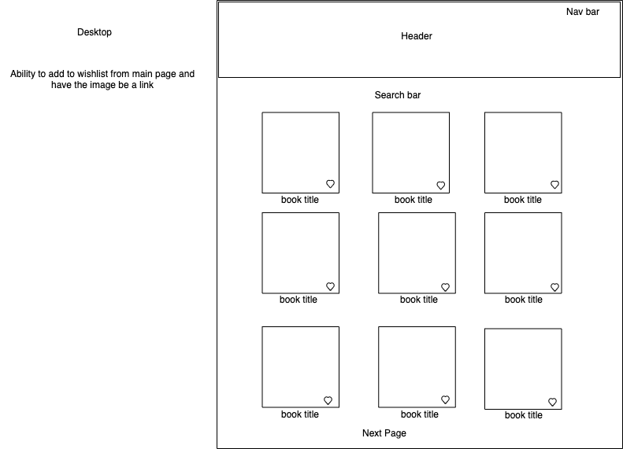
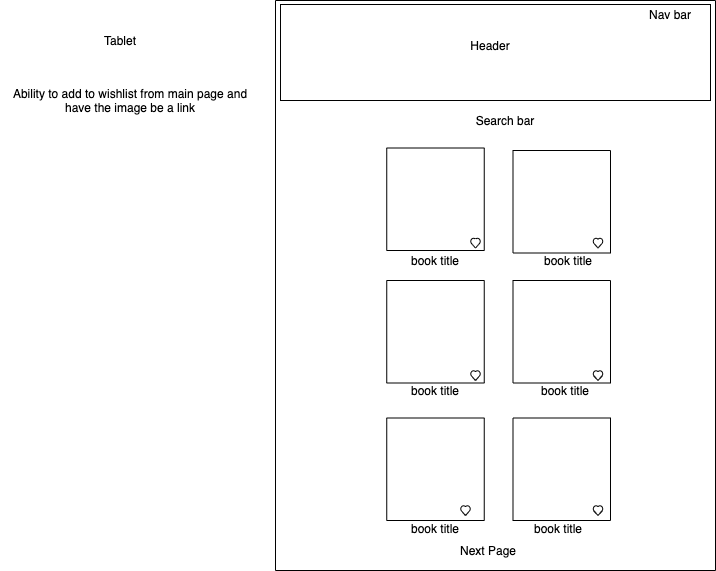
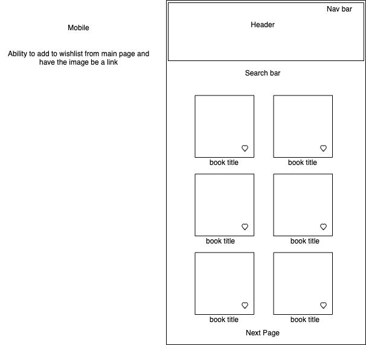

# pagebypage

[gif](https://gph.is/1UPlgSa)


  - [Overview](#Overview)
  - [Wireframes](#Wireframes)
  - [MVP](#MVP)
    - [Goals](#Goals)
    - [Libraries](#Libraries)
    - [Data](#Data)
    - [Component Hierarchy](#Component-Hierarchy)
    - [Component Breakdown](#Component-Breakdown)
    - [Component Estimates](#Component-Estimates)
    - [Helper Functions](#Helper-Functions)
  - [Post-MVP](#Post-MVP)
- [Project Delivery](#Project-Delivery)
  - [Code Showcase](#Code-Showcase)
  - [Code Issues & Resolutions](#Code-Issues--Resolutions)


### Overview

_**Page by Page** is your new favorite book app! Search for your favorite author or book and add it to your wish list! ._

<br>

### Wireframes




- Desktop 



- Tablet 



- Mobile 

<br>

### MVP

-_Create a search bar to search for books by title or author_<br>
-_Use a book api to add a library of books_<br>
-_Make a local storage that allows user to store their books on a wish list_

<br>

#### Goals

- _Successfully call and render api data_
- _Add Css_

<br>

#### Libraries


|     Library      | Description                                |
| :--------------: | :----------------------------------------- |
|   React Router   |                                            |
|     Link         |Will be using to link the pages to eachother.             |
|                  |                                            |

<br>

#### Data


|    API     | Quality Docs? | Website       | Sample Query                            |
| :--------: | :-----------: | :------------ | :-------------------------------------- |
| OpenLibraryAPI |           |    https://openlibrary.org/dev/docs/restful_api           |                                         |

<br>

#### Component Hierarchy


```
src
|__ assets/
      |__ tests
      |__ fonts
      |__ images
      |__ wireframes
|__ components/
      |__ Header.jsx
      |__ Nav.jsx
      |__ Search Bar.jsx
      |__ Books images/links.jsx
      |__ page link.jsx
      |__ Footer.jsx
```

<br>

#### Component Breakdown


|  Component   |    Type    | state | props | Description                                                      |
| :----------: | :--------: | :---: | :---: | :--------------------------------------------------------------- |
|    Header    |  |   |     | _Will have page title and nav bar._               |
|  Navigation  |  |    |   | _Will provide links to separate components/pages_       |
|   Book Images/links   |      |     |      | _This will be the results provided by the api._      |
|Page Links  |  |     |     | _Link function for the results when they have multiple pages_                 |
|    Footer    |  |     |     | _Copyright info._ |

<br>

#### Component Estimates


| Task                | Priority | Estimated Time | Time Invested | Actual Time |
| ------------------- | :------: | :------------: | :-----------: | :---------: |
| Pseudo code Home   |    H     |     3 hrs      |     TBD     |    TBD    |
| Pseudo code book showpage |    H     |     3 hrs      |     TBD     |     TBD     |
| Base code home              |   H       |     6 hrs      |     TBD     |     TBD     |
| Base code bookshowpage               |     H     |     6 hrs      |     TBD     |     TBD     |
| Add header            |       L   |     3 hrs      |     TBD     |     TBD     |
| Add footer              |      L    |     3 hrs      |     TBD     |     TBD     |
| Api            |      H    |     6 hrs      |     TBD     |     TBD     |
| Link Pages              |   H       |     6 hrs      |     TBD     |     TBD     |
| Base CSS               |     H     |     6 hrs      |     TBD     |     TBD     |
| Testing              |        H  |     8 hrs      |     TBD     |     TBD     |
| Finish CSS HOME              |   H       |     8 hrs      |     TBD     |     TBD     |
| Finish CSS BOOK              |    H      |     8 hrs      |     TBD     |     TBD     |
| TOTAL               |          |     70 hrs      |     TBD     |     TBD     |
<br>

#### Helper Functions


|  Function  | Description                                |
| :--------: | :----------------------------------------- |
|            | |

<br>

### Post-MVP

- _Add user accounts
- _Add the ability for the user to create their own bookshelves
- _Add review capabilites <br>
-_Add links to site to purchase books <br>
-_ Add a drop down menu for genre choices

<br>

***

## Project Delivery

### Code Showcase

>

### Code Issues & Resolutions

>
